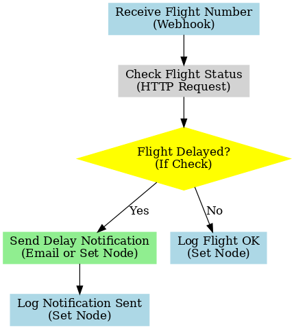

# Flight Delay Notification Bot (n8n Workflow)

> **Project Pitch:**  
> I built a lightweight n8n workflow that monitors flight statuses and automatically sends notifications if a delay is detected.  
> This helps travel service providers proactively manage pick-up schedules, customer communications, and operational efficiency.

---

## System Diagram  

---

## What it Does
- Receives a flight number from an incoming webhook
- Calls a (mocked or real) flight status API to check delay status
- If a delay is detected, sends a notification (via email, SMS, or dashboard alert)
- Logs the notification status for tracking and reporting

---

## Technologies Used
- **n8n** (workflow automation)
- **HTTP Request Node** (mock flight API call)
- **Conditional Check** (If node)
- **Email Node** or **Set Node** (simulate notification)
- **Set Node** (simulate logging)

---

## Files
- **flight-delay-notification-workflow.json** — Exported n8n workflow file
- **flight-delay-notification-diagram.png** — System flow diagram

---

---

## Future Work

- Integrate a live flight status API (e.g., AviationStack or FlightAware)
- Add airline-specific delay reason parsing
- Include multi-channel notification (SMS, WhatsApp, email)
- Track customer acknowledgment and log response feedback

---
*Demo built for AI Agent Implementation Manager portfolio presentation.*
